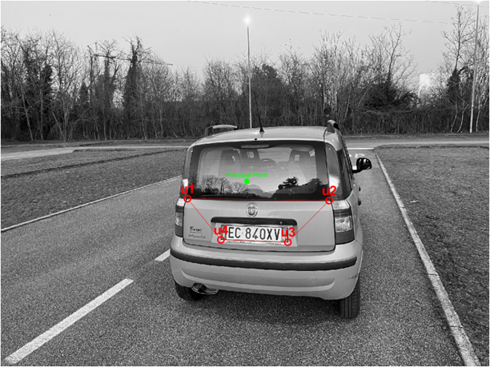
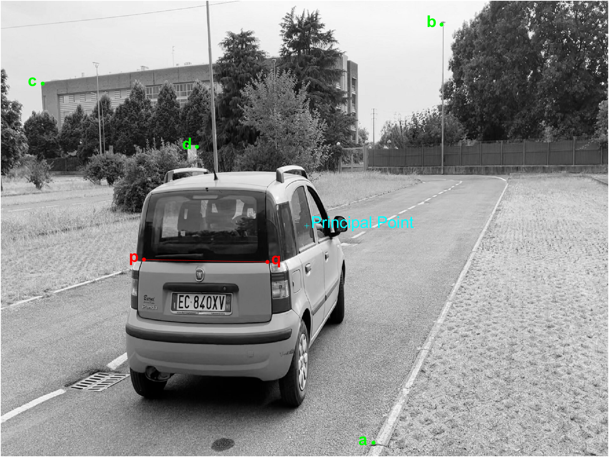

# <p style="color:#9EC6F3">Vehicle Space occupancy</p>
*A.A. 2024-2025* \
Image Analysis and Computer Vision (IACV) \
Department of Electronics, Information and Bioengineering\
**Ermelinda Giulivo** - **Luca Masiero**
\
\
The goal of this project is to develop an algorithm capable of estimating the 3D position of a vehicle from images captured by a fixed camera. The project is divided into two main objectives. The first focuses on localizing the vehicle using a single image by leveraging geometric constraints and known calibration parameters. The second, instead, uses three consecutive frames in order to estimate the trajectory of the vehicle over time. Both tasks assume the availability of prior knowledge—such as the camera’s intrinsic matrix and the fixed real-world distance between two identified feature points on the vehicle—to constrain and guide the reconstruction proces 

## Repository structure
The **main scripts** solving the two points of our project are stored in the ```matlab\scripts``` directory. In the ```matlab\function``` directory you can find every function used in the main scripts. \
\
```matlab\data\cameras``` stores the camera parameters obtained as a result of the calibration procedure. Here we have only one (i.e., iPhone), but in principle we can add any camera's parameters and update the main scripts when loading the parameters. Obviously, the iamges used then should have been taken with the same camera whose parameters we are going to load.\
\
The images used for testing are all stored in the ```img\``` directory, which has the following structure: 
```
imgs
    ↪ P1
    |   ↪ iPhone
    |       ↪ pandina
    |           ↪ image-1
    |           |   ↪ panda.jpg
    |           |   ↪ precooked.mat
    |           ↪ ...        
    ↪ P2
        ↪ iPhone
            ↪ pandina
            |   ↪ sequence-1
            |   |   ↪ 1.jpg
            |   |   ↪ 2.jpg
            |   |   ↪ 3.jpg
            |   |   ↪ precooked.mat
            |   ↪ ...        
            ↪ pen
```
The first point needs only one image to execute, then each ```image-i``` folder contains one image (always called *panda.jpg*).\
The second point need three images to execute, then each ```sequence-i``` folder contains at least three images (always called *1.jpg*,*2.jpg* and *3.jpg*).

#### What about the ```precooked.mat``` files ?
Well, they are matlab structures containing pre-extracted feature points, and they are very convenient for having a quick look at what the algorithms do and what are their results.\
In the following videos you can see how to use them.

## How to use
To execute the application is sufficient to run ```matlab/scripts/Point_1.m``` or ```matlab/scripts/Point_2.m```. In both cases a small UI window will appear; this allows you to select the *running mode* fot the application.\
\
**Point_1**:
- _Save feature_: if checked allows you to save the features you will select on the image. These points are saved in a file called ```precooked.mat``` inside the same directory as the image. Features are not saved in case _Use precooked examples_ is checked.

- _Use precooked examples_: if checked you can (and must) select a ```precooked.mat``` for the image you prefer. Remember that the file can be found in the same directory as the image. The saved features will be plotted on the image and the results will then be shown.

\
**Point_2**:
- _Save feature_: it follows the same principle as for Point_1

- _Use precooked examples_: it follows the same principle as for Point_1

- _PenTesting_: if checked you can (and must) select a sequence of frames of the pen instead of the car. The application will automatically open the File Explorer window in the right folder, which is ```imgs/P2/iPhone/pen/```. If not selected the folder you will end up in will be instead ```imgs/P2/iPhone/pandina/```.

- _Apply DLT_: if checked the application requires you to select four features in each frame for DLT based frame alignment or, if you have selected _Use precooked examples_ it will plot on the frames also the DLT feature points. 

#### ⚠️ A word of caution on feature extraction ⚠️
As written in each one of the two main scripts, when manually selecting the features, is very important to respect a given order, so that the program is able to understand which point has been extracted.\
\
For **point 1** you should extract the features of the quadrangle clockwise, starting from the top-left feature:
1. left taillight
2. right taillight
3. bottom-right corner of the license plate
4. bottom-left corner of the license plate



For **point 2** you should first select the car features from left to right:
1. left taillight (*p*)
2. right taillight (*q*)

and then, if needed, the four feature points used for DLT (*refer to the report for more details*), whichever you want as long as they are selected in each frame with the same order.

\
\
\
The following videos shows how to use the application.\
\
**Video 1**: executing _Point_1_ and using "precooked" features\
<video src="https://github.com/user-attachments/assets/023590a7-f0bb-4343-b9fc-2333998ae176"></video>

**Video 2**: executing _Point_2_ and using "precooked" features with DLT\
<video src="https://github.com/user-attachments/assets/2bc471cf-6066-460d-8e70-19aac2560805"></video>

**Video 3**: executing _Point_2_ and extracting features manually (no precooked examples)and no DLT\
<video src="https://github.com/user-attachments/assets/2fa5f07c-8f66-4f44-8ee0-8165aff45a24"></video>

## Framework and Toolbox
There are a couple of Toolbox used by our matlab application:
- [Image Processing Toolbox](https://it.mathworks.com/products/image-processing.html)
- [Global Optimization Toolbox](https://it.mathworks.com/products/global-optimization.html)
